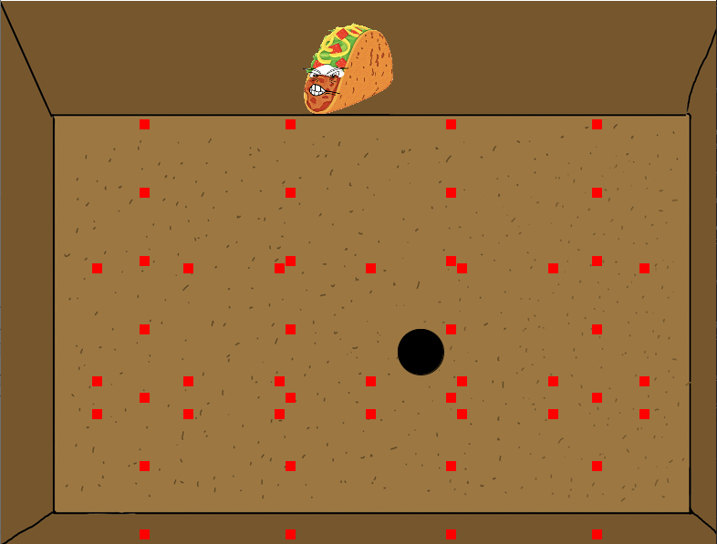
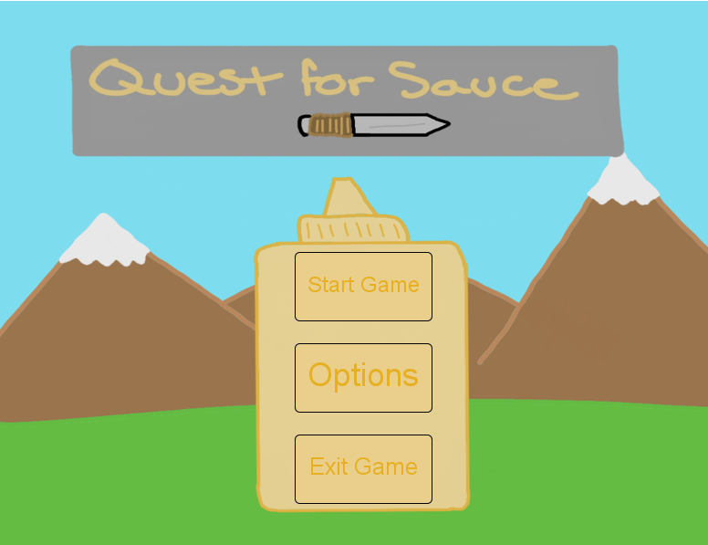
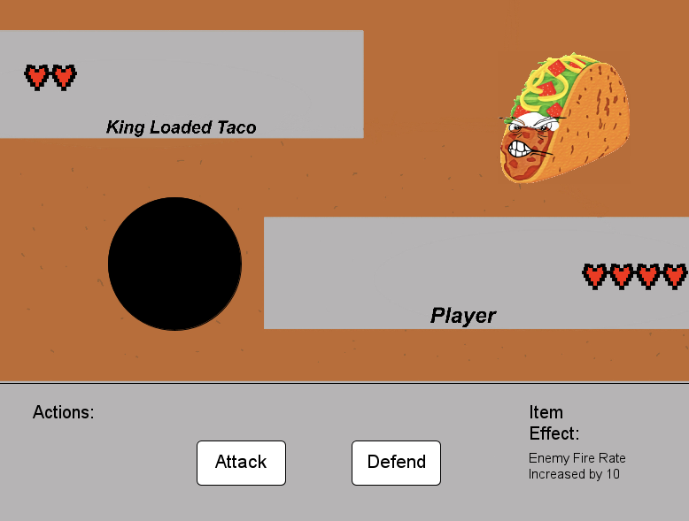
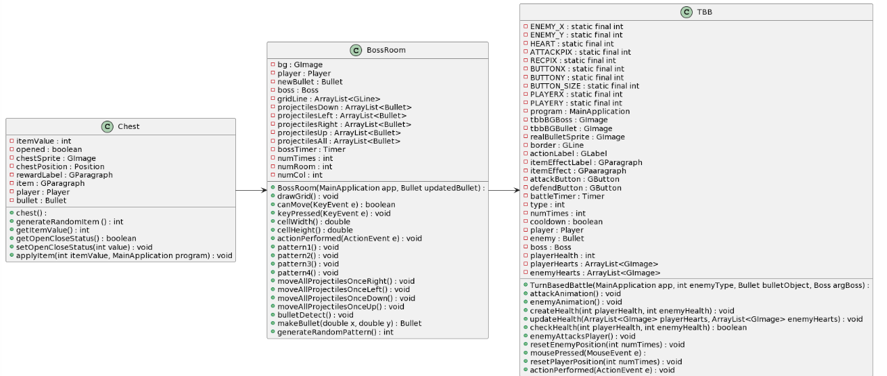
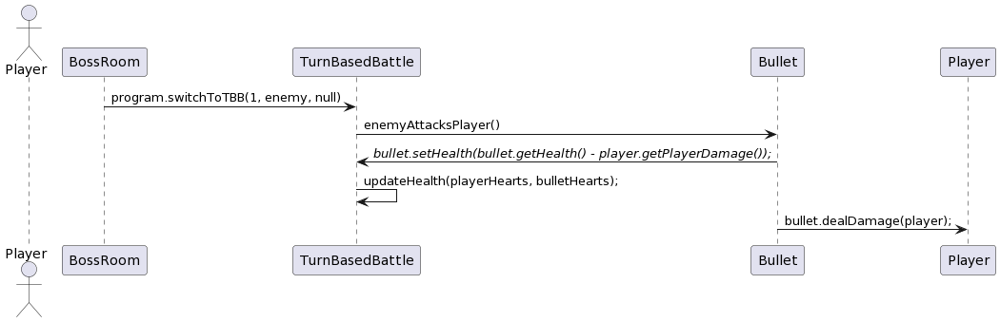

# Customer Statement of Requirements
The project “Quest for the Forbidden Sauce” was chosen due to our group’s love for video
games. Limited by our skills, we have chosen a 2D bullet-hell style game with turn based battle
mechanics implemented to set us apart from typical games. With the development of our game,
we want to give our customers a feeling of enjoyment and satisfaction as they complete the challenges associated with our game. 

This
project is meant to appeal to fans of top down
games such as:
- “Stardew Valley”
- “Divinity”,
- “The Legend of Zelda: Link’s
Awakening”. 

The mechanics associated with
them such as top-down movement, adventure and looting aspects are what we want our
customers to experience. The second genre we
would like to take aspects from is the bullet-hell
genre, which includes aspects of dodging and
avoiding on-screen projectiles for a prolonged
period of time. The last genre that we are
pulling inspiration from are turn-based games, such as “Pokemon”. The mechanics associated
with this genre allows users to strategize and come up with new tactics to tackle the game with.
A unique mechanic that is seen in all turn-based
combat games is the use of a health-bar which we
plan to implement in our project as well. To find
more information about top-down games, click [here](https://en.wikipedia.org/wiki/Video_game_graphics#Top-down_perspective). For the bullet-hell genre, click [here](https://www.giantbomb.com/bullet-hell/3015-321/). Finally, for turn-based combat systems, click [here](https://tvtropes.org/pmwiki/pmwiki.php/Main/TurnBasedCombat#:~:text=A%20form%20of%20Tabletop%2FVideo,for%20everyone%20on%20the%20battlefield.).

# Functional Requirements
## Use Cases
1. On Startup have a Title screen with three button options
    - The options will have the text “Start”, “Options”, and “Quit”. The start button will start the game, the options button will transition to a different screen with the ability to turn the volume on or off. The quit button will exit the application.
        
2. On starting the game, the player will be spawned into an empty room with a chest.
    - The chest will be implemented with a random number generator from 0 to 10 and depending on the number the player will be gifted a variety of buffs or nerfs ranging from things like a movement increase to a nerf that makes the player deal less base damage
3. Once the user enters the next room the bullet hell portion of the game will start.
    - The battle will start as a bullet-hell and the player will be required to dodge projectiles for a prolonged period of time until the boss will face the player in a turn-based attack sequence.
        
4. Upon getting hit with a projectile, the player will engage in a turn-based battle with the projectile. Yes, the projectile, or after a set time has passed the player will enter a turn based battle with the boss.
    - The user will have the option to attack or defend.
    - After choosing an action, the action will be carried out and the turn will switch over to the enemy NPC.
    - Once the player beats the bullet, the turn-based sequence will end and return to the top down perspective after the user character or the enemy character lose all their health.
        
5. If the player beats the boss, the player will be able to enter a door to the next room.
    - This room will be the final room where the player has achieved the goal of “retrieving the sauce”. Upon interacting with the item, the game will conclude with the win screen. 
6. If the player loses to the boss, the user will be sent to the game over screen.
    - This will be the final screen of this attempt. The game will then offer the options to replay or exit the game.
    - No matter what happens to the player, whether they die or succeed the same sequence of events will happen. The player will then be given the options to click “Continue”or "Exit" again.
- Future Work:
    - The options button in the main menu will allow the user to change the volume of the sounds instead of being an on or off button. Another possible action would be to allow the user to change the color of the player.
    - Implementing frames will allow the addition of animations making the story of the game a lot more fleshed out and smooth.
    - Incorporating time-based events is also another thing to add that will allow a fully fleshed out, interactive story.

# Class Diagram and Interface Specifications

# Interaction Diagrams

# References
- https://www.thegamer.com/fantastic-top-down-isometric-rpg-games-ranked/ - Figure 1, page 3
    - Picture used to give the audience an idea of what a top-down game looks like.
- https://www.indiedb.com/games/guardian-earth-hd/images/bullet-hell - Figure 2, page 3
    - Picture used to give the audience an idea of what a bullet-hell game looks like.
- https://hardcoregamer.com/features/five-major-changes-pokemon-switch-could-bring-to-the-series/280057/ - Figure 3, page 3
    - Picture used to give the audience an idea of what a turn-based battle mechanic looks like.
- https://en.wikipedia.org/wiki/Video_game_graphics#Top-down_perspective - page 4
    - Used for the reader to acquire more information about top-down games.
- https://www.giantbomb.com/bullet-hell/3015-321/ - page 4
    - Reference for the reader to learn more about bullet-hell games.
- https://tvtropes.org/pmwiki/pmwiki.php/Main/TurnBasedCombat#:~:text=A%20form%20of%20Tabletop%2FVideo,for%20everyone%20on%20the%20battlefield. - page 4
    - Reference for the reader to learn more about turn-based battle games.
- https://download.eclipse.org/rt/rap/doc/2.1/guide/reference/api/org/eclipse/swt/events/KeyListener.html - page 7
    - Reference for the reader to understand more about key listeners
